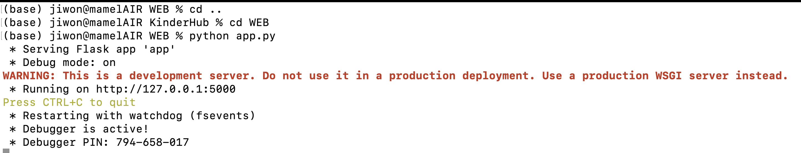

# KinderHub
유치원 커뮤니티 향상을 위한 학부모-교사 소통 플랫폼

## Tech Stack

- Python
- PostgreSQL
- Flask

## 목차

1. 프로젝트 소개
2. 팀 소개
3. 파일 구조
4. 설치 및 사용법

## 프로젝트 소개

이 프로젝트는 유치원 원아들의 정보 체계 관리, 효과적인 일정 관리, 학부모-교사 간의 개별 소통 채널 제공, 식단표 확인, 안심 하원 서비스 도입, 게시판 질문과 답변 기능, 그리고 중요한 알림 서비스를 통해 학부모와 교사 간의 원활한 의사 소통과 안전한 유치원 학습 환경을 제공한다.

## 팀 소개
| 이름 | 김윤하(https://github.com/xdbsgk) | 구지원(https://github.com/kUZEEwon) |
|:------:|:----------:|:----------:|
|  |  |  |
| 개발 내용 |  |  |


## 파일 구조
```
📦 KinderHub
.
├── Data
│   └── termkk_backup.sql
├── README.md
├── Report
│   ├── 보고서
│   │   ├── progress report.docx
│   │   ├── project proposal report.docx
│   │   └── review
│   └── 회의록
│       ├── 2023_11_16 회의록.md
│       └── 2023_11_19 회의록.md
└── WEB
    ├── __pycache__
    │   ├── test_all.cpython-310.pyc
    │   └── test_all.cpython-311.pyc
    ├── app.py
    ├── templates
    │   ├── board.html
    │   ├── dashboard.html
    │   ├── error.html
    │   ├── guardianselection.html
    │   ├── index.html
    │   ├── info.html
    │   ├── insert_chat.html
    │   ├── login.html
    │   ├── meal.html
    │   ├── new_free_board.html
    │   ├── notification.html
    │   ├── post_detail.html
    │   ├── registering.html
    │   ├── schedule.html
    │   ├── student_registering.html
    │   └── write_notification.html
    └── test_all.py
```

## 프로그램 사용 매뉴얼

### 데이터베이스 초기 설정

- Create New Database
    - 데이터베이스 강의에서 사용한 기존의 ts_db2023의 TABLESPACE에 새로운 DATABASE를 생성해준다.
        
        ```sql
        postgres=# CREATE DATABASE termkk OWNER db2023 TABLESPACE ts_db2023;
        CREATE DATABASE
        ```
        
- 테스트에 필요한 테이블 및 데이터 추가
    - **Data** 디렉토리 내부의 **termkk_backup.sql**을 다운받고, 다음과 같은 명령어를 실행시켜 데이터베이스의 구조와 데이터를 저장시킨다.
        
        ```sql
        psql -U db2023 -h localhost -d termkk < termkk_backup.sql
        ```
        
### 프로그램 실행 방법

- 새 폴더를 생성하고 해당 폴더에 git branch를 열어서 해당 명령어를 입력 한다.
    
    ```c
    git clone https://github.com/PNU-CESKids/KinderHub.git
    ```
    
- cmd창 (Windows), terminal (Mac)를 열어준 후 해당 폴더로 이동한다.
- KinderHub/WEB 으로 이동후 아래의 명령어를 입력하여 `app.py`를 실행시킨다.
    
    ```c
    python app.py
    ```
    
    {: width="50%"}
    
    실행이 완료된 화면
    
- Chrome에서 [http://127.0.0.1:5000/](http://127.0.0.1:5000/) 으로 이동한다.

### 기능별 실행 방법

[https://127.0.0.1:5000/](https://127.0.0.1:5000) 으로 접속하면 아래와 같은 화면이 나온다.

{: width="50%"}

index.html

자신의 계정이 있으면 login 버튼을 눌러 로그인을 진행하고, 계정이 없으면 register 버튼을 눌러 회원 가입을 한다.

**로그인 이전**

- **회원가입(계정이 없는 경우)**
    
    {: width="50%"}
    
    registering.html
    
    - `Student`는 회원가입을 진행할 수 없다.
    - 자신의 역할이 `Teacher` 이거나 `OtherSchoolStep` 또는 `Principal` 일 때는 제일 하단의 studentID를 입력하지 않아도 된다.
    - register 버튼을 누르면 회원가입이 완료 된다. 완료 후 [Login here](http://127.0.0.1:5000/login)을 눌러 로그인을 진행한다.
- **로그인**
    
    {: width="50%"}
    
    login.html
    
    - 자신의 Email, Password를 입력해서 로그인을 한다.
    
    {: width="50%"}
    
    로그인 실패화면
    
    - Email 이나 Password를 잘못 입력하여 로그인에 실패하면 다음과 같은 문구가 나온다.

**로그인 이후**

- dashboard
    - 로그인이 성공하면 dashboard가 나온다.
    
    {: width="50%"}
    
    dashboard.html
    
    - 자신이 로그인한 계정의 username, userrole이 있는 환영문구가 나온다.(이미지의 빨간색 부분 참고)
    - 자신이 원하는 기능을 메뉴에서 선택해서 들어갈 수 있다.
    - 제일 하단의 ‘Logout’버튼을 눌러 로그아웃을 할 수 있다.

**메뉴별 설명**

- My Information/Child Information
    
    {: width="50%"}
    
    info.html
    
    - 자신의 정보와 자신에게 속한 `Student`정보를 확인할 수 있다.
- **Board(게시판)**
    
    {: width="50%"}
    
    board.html(Free Board)
    
    dashboard에서 Board를 선택하면 board.html로 들어간다.
    
    - 글 쓰기
        
        {: width="50%"}
        
        new_free_board.html
        
        Title: 글의 제목
        
        Content: 글의 내용
        
        위의 내용을 입력후 ‘글쓰기’버튼을 눌러 글쓰기를 완료한다.
        
        완료한 이 후 ‘글 목록’을 클릭하여 `Free Board`로 돌아온다.
        
    - 글 전체 조회
        
        글쓰기를 완료하면
        
        {: width="50%"}
        
        자신이 쓴 글이 글쓰기 화면에서 보이고 
        
        자신이 작성한 글만 삭제할 수 있도록 자신의 작성한 글만 Delete버튼이 보인다.
        
    - 글 상세 조회
        - `Free Board(글 전체 조회)`에서 제목을 클릭하면 해당 게시물의 상세조회가 가능한 페이지로 이동한다.([http://127.0.0.1:5000/post/{post_id}](http://127.0.0.1:5000/post/{post_id}))
            
            {: width="50%"}
            
            post_detail.html
            
        - Post Detail에서 글 상세 조회가 가능하다.
        - Comments에서는 댓글 작성과 조회가 가능한다.
        - 글 목록을 누르면 `Free Board(글 전체 조회)` 로 이동한다.
- **MealPlan(식단표 작성 및 조회)**
    - dashboard에서 Meal Plan을 선택하면 meal.html로 들어간다.
        
        {: width="50%"}
        
        Today’s Meal: 오늘의 식단을 확인할 수 있다.
        
    - **식단표 작성**
        
        {: width="50%"}
        
        Register Meal for Other Dates 에서 식단 등록이 가능하며,
        
        식단에 해당하는 날짜, Meal1, Meal2, Snack을 순서대로 선택 후 Register Meal 버튼을 누르면 등록이 완료된다.
        
    - **식단표 조회**
        
        {: width="50%"}
        
        View Meals for Other Dates에서 조회를 원하는 식단의 날자를 (YYYY-MM-DD)형식으로 입력하고 버튼을 누르면 조회가 된다.
        
- **Notification(알림장) - Teacher, Guardian만 접속가능**
    - **Teacher, Guardian외의 role일 때**
        
        {: width="50%"}
        
        화면과 같이 경고문구를 확인할 수 있다.
        
    - **Teacher 일 때**
        
        dashboard에서 Notification를 선택하면 notification.html로 들어간다.
        
        {: width="50%"}
        
        notification.html
        
        ‘Write the Notification’ 버튼을 눌러서 [알림장 쓰기 화면](http://127.0.0.1:5000/notification/write)으로 들어간다.
        
        - 알림장 쓰기
            
            {: width="50%"}
            
            write_notification.html
            
            Message: 자신이 입력하고 싶은 알림 메세지 입력
            
            Select Student: 자신이 알림을 줘야할 학생 선택
            
            위의 내용을 입력 후 채팅보내기를 누른다.
            
            **채팅 보내기가 성공적**으로 이루어 지면
            
            {: width="50%"}
            
            해당 메세지(이미지에 표시)가 나오며
            
            다시 알림장 목록으로 돌아가기 위해 알림장 목록을 클릭한다.
            
        - 알림장 조회
            
            {: width="50%"}
            
            자신이 보낸 알림사항을 조회화면에서 확인할 수 있다.
            
            - `Teacher`은 자신에게 속한 모든 학생의 알림사항을 조회 할 수 있다.
    - **Guardian 일때**
        - 알림장 조회
            
            {: width="50%"}
            
            - `Guardian`은 자신의 `Student`에 대한 알림만 조회할 수 있다.
        - 알림장 쓰기
            - `Teacher`과 동일하다.
- **Schedule**
    - 스케쥴 등록
        
        {: width="50%"}
        
        등록 성공 시 아래와 같은 화면에서 등록 성공 메세지를 확인할 수 있다.
        
        {: width="50%"}
        
    - 스케줄 조회
        - Guardian
            
            자신의 학생에 대한 정보만 확인 가능하다.
            
            ![studentid=3에 대한 보호자 화면]Report/imgs/Untitled%2021.png){: width="50%"}
            
            studentid=3에 대한 보호자 화면
            
- Safe School Service(안심 하원 서비스)
    - **User Role ⇒ Teacher, Principal, OtherSchollStaff**
        - 모든 학생의 정보 출력
        
        {: width="50%"}
        
        Teacher, Principal, OtherSchoolStaff의 조회 화면
        
    - **User Role ⇒ Guardian**
        - Guardian에 속하는 학생의 하원정보 만이 조회된다.
        - Guardian 선택 기능
            
            Guardian만이 student의 하원 주체를 선택할 수 있다.
            
        
        {: width="50%"}
        
        Guardian의 조회화면
        
    - **User Role ⇒ StudentFamily**
        - StudentFamily에 속하는 학생의 하원 정보만이 조회된다.
        
        {: width="50%"}
        
        StudentFamily의 조회화면

